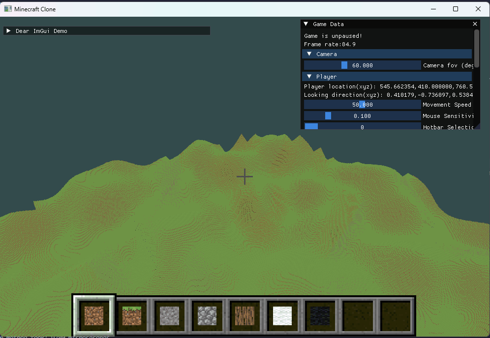

# DevLog
## 16/3/2026
I'll move the frustum culling to the render.
That way, the frustum culling is done each frame instead of each game tick.
Currently, when I move the camera quickly, the chunks on the edges of the screen are not rendered.
Will decrease the frame rate by a bit, cause with render distande 40, the frustum culling takes about 1800us.
But should be worth it.
Yeah, looks way nicer now.

I noticed that there's a huge bottleneck on the world update function by setting up the threads. 
Like even just starting all the threads for the generating terrain can take like 15000us and all it does is start the new threads.
I did some research and apparently the way to go is to use thread pools.
Ok I added the thread pool from https://github.com/bshoshany/thread-pool. 
The number of threads is equal to my systems nubmer of cpu's minus one (so I can keep running the main thread on one cpu).
I call the asychronous functions using pool.detach_task.
This has the advantage of not having to make futures and making a new mutex and stuff.
Speeds it up by a lot.

Still some frame drops, but in my defense, in the normal game you would never fly this high and render that many chunks simultaneously.
Plus, the frame drops are only there when you are flying through the world at break neck speeds.
I think I should start focusing on adding things to the game again.

### Ambient Occlusion
Alright so I started reading the learnopengl page on ambient occlusion (SSAO) and that stuff is super complicated.
But we are dealing a block world, so its actually simpler.
We can just check for each corner how many solid blocks are adjacent to the vertex and could be blocking light. 
For this we have like 5 options.
I guess I just arbitrarily pick a number for each of these options.
These numbers then show how much the colours get darkened in that corner and the shader interpolates that for the full face.

I had to change a lot of code, because I need to check all 8 neighboring chunks during the mesh creation in order to find the ambient occlusion.
And it was quite tedious to find which locations I need to check for which direction and which corner of the face in that direction.
But I managed in the end, and the result is suuper nice.

## 15/3/2026
Finally fixed the frustum culling today.
It seemed to be working pretty smoothly in terms of culling, but the problem was that I was not rendering the chunks on the side of the screen.

I spent way too long thinking it had to do with the position of the projection plane and the camera.
I thought the culling was going incorrectly, because I was doing the frustum culling from the center of the projection plane as opposed to from the "eye" of the frustum.

Well that was not the problem actually.
First of all, I wrongly assumed that the fov parameter in the perspective matrix was the fovX, but it's actually the vertical field of view, fovY.
Second of all, you cant get the other field of view by just multiplying with the aspect ratio, no no no.

No the actual way to get the other field of view is a bit more complicated.
Allow me to explain:
Assume the projection plane is at z=-1 in camera space (usually it's at the near plane of the frustum).
Then there is a rectangle on this plane that coincides with your screen/window.
Since fov is the vertical field of view, the top edge of this window is exactly at y=tan(fov/2) (where fov is the angle in radians.)
This window has the aspect ratio width/height, so the left edge of this window is at x=width/height*tan(fov/2).
We also know the left edge is at x=tan(fovX/2), so we get fovX = 2*arctan(width/height * tan(fov/2)).

And now it works perfectly!
The fps increase is absolutely great.

Of course it still drops when I fly super high and try to render all the chunks anyways.
Maybe I should just set a limit of chunks to render each frame. Yeah thats a great idea, we can just do an nth element sort of the chunks.

And we could even set a limit for the vegetation, water and terrain chunks? 
Yep I set a limit to the number of chunks that render vegetation, water, terrain.
Really nice, because when you are on the ground you never notice it, and when you fly, the framerate doesnt drop.

## 14/3/2026

Frustum culling today.
The mathematics is not super trivial, but I think I can do it in a better and simpler way than I could find on sites like learnopengl.com.

### Frustum Culling
So, just as a simple explanation: The frustum is defined by 6 planes: top, bottom, left, right, near, far.
All of these planes are defined by a normal vector N which is perpendicular to the plane and a number c.
The plane is defined by the subset of points for which the inner product of the vector N is exactly c.
A point in space is considered to be on one side of the plane when the inner product is >c and on the other side of the plane if <c. 
Also, we define the normals of the planes, so the inside of the frustum has a positive inner product with all planes and the c's are non-negative.
For simplicity, we assume the camera is exactly at (0,0,0). (Easy to do, we just shift all coordinates in space by the position of the camera).
In that case, the c's for the top, bottom, left, right planes are 0.

For the near and far planes, we simplify a bit.
We merely use the forward direction of the player to check the distance to the camera and then we just check whether the point is between the nearDistance and farDistance nubmers. 
Btw this is not the actual distance, but its the distance of the projection of the point onto the forward vector.

The normal of the other planes is given by starting with a normal that is perpendicular to the forward vector and then we move it by half of the fov.
I guess thats the same as turning the forward vector by 90 degree minus half the fov.
We have a fov parameter, but I think thats just for the x-z axis (yaw direction).
We can get the y axis (pitch direction) fov by multiplying the normal fov with the y x ratio of the current window.

Now here's the ugly part:
To check whether a box should not be culled, I have the following idea: we check for each plane whether at least one of the vertices of the bounding box is on the right side of the plane.
And then if this is true for each plane, we dont cull the object.

There are two important things to realize:
- This can give false positives:
We can have a hitbox that is entirely outside of the frustum, but for each plane, there is some point in the frustum on the proper side of the plane.
- It doesn't suffice to check whether any of the vertices of the bounding box is entirely inside of the frustum, because there are examples of objects that intersect with the frustum, but none of the vertices are inside of the frustum.

So what it comes down to, is that we throw away all objects for which there is some plane for which all the vertices are on the wrong side of the plane.
In that case, it's impossible for an element inside of the bounding box to be inside of the frustum.

Ok it seemed to be working quite nicely, but I messed really badly.
I was using pitch and yaw to turn the forward direction and to get the normals.
But this doesn't work because when you're looking down, changing the yaw barely changes the vector!

Ok, so the proper way to do it is to use the cross-product and stuff for finding the rotating axes.

## 13/3/2026
Spent most of the morning refactoring the renderer class cause it was getting way too big and I was losing the overview and spent too much time searching.
Added two render classes: ChunkRenderer and UIRenderer.
Was a bit of a hassle on how to set it up in terms of sharing render settings and having a reference to the Renderer class.
Of course I forgot about the circular includes.
But yeah, works now and I think it's much better this way.

Oh my, I finally got the texture atlases working.
There were some bugs that were super hard to track, but managed in the end.  
Looks way nicer now.

Alright, I also optimized the mesh calculation so that the result of the mesh calculation can go straight into the gpu.

Today was a good day.

## 12/3/2026
Alright, won't have as much time today, but anyways.
Added a leaf to my tree that I forgot to render.

I fixed that trees dont places leaves into non-air blocks.
Water faces now render both sides.
When underwater, it no longer displays the block you're targeting.
Added a blue tint when underwater.

## 11/3/2026
Ok I spent the morning trying to get everything to run on another computer.
Apparently some setups were not as universal as I thought, so I had to install the mingw gcc compiler and re compile the glfw and everything.
Of course this stuff is always more work than you expected, but at least I can tell I'm getting faster at dealing with problems and understanding how this all works.
Quite dependent on AI to help me brainstorm the possible problems...

Anyways, going to work on adding and rendering water now.

Yay, added the translucent rendering and have see through water blocks now!
First I was also rendering the faces between water blocks, but I fixes that now.
Looks really good. The problem is that I actually need to sort all the translucent blocks in distance from the camera, because if you have two block behind each other with a gap, it wont always show the one in the back.
There is still depth testing for translucent blocks, so we ideally render the ones in the back first.
This means we have to sort all the water blocks every time a player moves and upload those to the gpu.
That's a lot of work. I will leave that to later.
For now I want to focus on world generation, because with water, trees and flowers I can generate super cools landscapes.

Currently thinking about how to do the chunk generation so that we can still run it all asynchronously.
Currently all the chunks have an attribute that contains the generation data.
But since we are only reading, its apparently safe to read from the same data as long as it never changes.
So I was considering making like a static class or a namespace.
I think I will do a namespace actually, seems perfect for this scenario.

I refactored the terrain generation code and I got water working! Looks really cool.

Alright I also added flowers and grass to the chunk generation.

cool I added the tree generation. So far its just tree trunks though, I will add a tree model as a queue of offsets containing leaves I think.
The game did slow down a lot though. Still aroun 60 fps, but drops are frequent.
I know one way I can speed it up by a lot.
I also realized that I need to consider all 8 neighbors when making the tree and not just the four adjacent chunk neighbors. That will be a bit annoying to add.

In the middle of doing the trees, I added underwater plants.
It took a surprisingly short time, even though I add a bunch of things, for example: the I added a new underwater block flag, so water would also render on the face of a block containing an underwater plant.

Ok its looking quite nice now.
The trees are rendering. And the underwater plants are nice as well.
There's one problem, the program crashes when I try to do the tree generation asynchronously.

Wooow found the bug to why the tree generation was crashing.
That was some real cpp type shit. 
I move the pointers to the chunks to a c array, but of course then the pointers dont get copied.
So I changed it to std::array and that solved the problem.
I got pretty far with debugging, because I found that the neighboring chunks had a flag set to false that was previously true and there was no way set it back to false.
So I knew something was up with the pointers.
And then Claude came in clutch and told me about the problem with the c style array( which is basically just a pointer as well).

Tomorrow, I will make the trees check that there is not already a block on spot where they want to place the leaves.

## 10/3/2026
Working on rendering the flowers.
Alright I added the possibility to place flowers and they show up in the hotbar as well.
Problem is that we can place blocks unto flowers, I think I will fix that later, its not a problem for now.

Did need to change the block Targeting algorithms so now it just check whether the block is anything other than air.
I still dont render the flowers though.

Refactored the chunkRender function in the Renderer class and I think I found a major speed up: I didnt set the updated flag to false when creating the VBO, which meant it would update the VBO in the next frame, even if nothing changed.

Yay, I added the flower rendering. There were some hiccups naturally, but it works perfectly in the end. Plus, I refactored the render class, so adding the translucent rendering should be quite natural.
I added the leaves! Not too sure about which block flag I shall use. Ended keeping backside culling on and I just add both sides of the flowers to the meshes.
I had to add a tint parameter to the cutoutMesh, because the leaves are just in gray scale.

The leaves in the hotbar now also have the proper colour.

## 9/3/2026
Have been working a lot on the project lately.
Today I have finally fixed the asynchronous chunk generation, asynchronous mesh creation and setting a limit to the number of meshes that can be added to the gpu per frame.

I also did a lot of other optimizations. 
Seems to be running very smoothly now. 

Also removed the rendering of the bottom of the map, which speeds up quite a bit as well.
Guess I will start on other things now, such as water and flowers.

## Before

 
 

Alright, I started on this project a while back, but took a very long break.
I think I did a bunch in September 2025. Then in February/March 2026 I picked it up again.

This devlog started at 9th of March 2026.
Before that I had the following features already:
World:
- World is split into chunks
- I have an enumeration called BlockType with the types of blocks in my world, such as dirt, stone, cobblestone, different types of wool
- The player can fly around the world and the world gets generated infinitely.
- the chunk generation and the mesh creation happens in different threads than the main thread.
- Right now the world only consists of dirt and grass dirt
- I use Perlin noise for the height of the land.
- The player has the ability to destroy and place different kinds of blocks

UI:
- I have Dear Imgui to show game data and we can chance game settings while the window is open.
- Pause the game with p
- There's a crosshair 
- We make have black lines around the selected block
- We have a hotbar with a couple of different block we can place. Scroll through the hotbar.

Rendering:
- Each chunk creates a mesh of the faces that are adjacent to a non-opaque block (such as air)
- The chunk has a dirty flag, to indicate that it needs to be recalculated.
- These meshes are sent to the Renderer if they are in range of the player. The structs for communication between the World class and the Renderer Class are in the Renderable.hpp file.
- The renderer checks if its a new chunk, an old chunk but with a new mesh or already has the proper mesh stored in the GPU
- If necessary, the mesh is translated to a proper VBO and uploaded to the GPU

